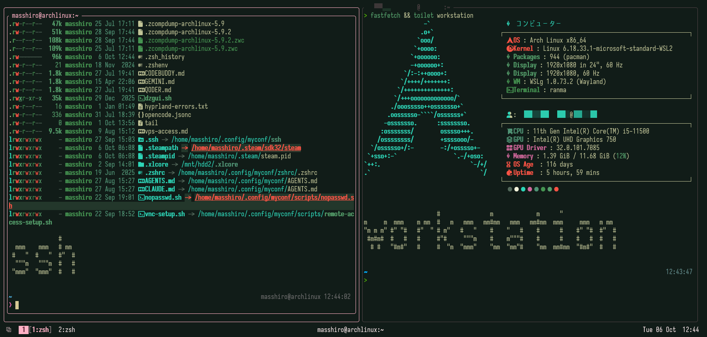

# ranma



A tiling window manager for the terminal: i3's container tree and Hyprland's
dwindle placement, where every window is a PTY. Sessions, workspaces, a floating
layer and a scratchpad, driven by a leader key and a modal WM mode, configured in
Lua and themed in TOML.

Named for the 欄間, the carved transom panel above sliding doors.

**Status:** milestones 1-4 of [`doc/ROADMAP.md`](doc/ROADMAP.md) are done — a
daily-drivable tiling window manager: dwindle-tiled panes, tabbed groups, a
floating layer, workspaces and sessions with fuzzy switchers, a scratchpad,
copy mode and history search with the system clipboard, window rules, a
waybar-style bar with Lua and shell modules, Lua binds and hooks, mouse focus,
and live config reload. It runs as a server, so closing the terminal (or losing
SSH) only detaches: `ranma` again picks up where you were. `leader ?` lists
every key, and `leader :` runs any action by name.

## Install

```sh
./install.sh            # build, install to ~/.cargo/bin, check it against your config
./install.sh --check    # run the full pre-commit gate first
./install.sh --uninstall
```

**Linux only.** ranma reads `/proc` to know what runs in each pane, so it does
not work on macOS or the BSDs. WSL2 works.

Needs Rust 1.88 or newer (`cargo`) and a C compiler (ranma builds its Lua from
source). Optional, at run time:

- `wl-paste` (wl-clipboard) or `xclip` for `paste_image` on Wayland or X11;
  under WSL it uses `powershell.exe`. Any other command can be set with
  `paste.image_command`.
- OpenSSH (`ssh`) on both ends for pasting images into a pane that runs ssh.
- `xdg-open` for opening links from hint mode.
- `tmux`, only for the smoke test (`scripts/smoke.sh`).

After installing, the new binary is run against your config; if it rejects it,
the previous binary is put back, so a terminal that starts ranma never falls
back to a plain shell because of an upgrade. Running instances keep the old binary until
they exit.

Then start it with `ranma` (or from your shell startup: see
[`doc/CONFIG.md`](doc/CONFIG.md)). `Ctrl+b ?` lists every key.

```sh
ranma --dump-config    # the default init.lua, which documents every option
ranma --check-config   # validate ~/.config/ranma/init.lua and its theme
```

- [`doc/DESIGN.md`](doc/DESIGN.md): what ranma is, what it refuses to be, and why
- [`doc/CONFIG.md`](doc/CONFIG.md): the configuration and theme reference
- [`doc/ROADMAP.md`](doc/ROADMAP.md): milestones
- [`doc/TESTING.md`](doc/TESTING.md): what to run, and what each check proves

## Contributing

Read [`doc/DESIGN.md`](doc/DESIGN.md) first: it records the decisions and the
non-goals, and a feature on the non-goals list needs the design changed before
it needs a pull request. [`AGENTS.md`](AGENTS.md) has the conventions.

Arm the git hooks once per clone:

```sh
scripts/hooks.sh
```

They run `cargo fmt --check` and `cargo clippy --all-targets -- -D warnings` on
commit, and `cargo test` plus the smoke test on push. `doc/TESTING.md` says what
each check covers.

## License

Licensed under either of [Apache License, Version 2.0](LICENSE-APACHE) or
[MIT license](LICENSE-MIT), at your option.

Unless you explicitly state otherwise, any contribution intentionally submitted
for inclusion in ranma by you, as defined in the Apache-2.0 license, shall be
dual licensed as above, without any additional terms or conditions.
